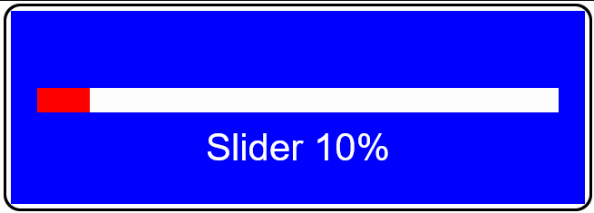

# pfodWebDesigner
This is a web base design tool to create interactive and responsive GUIs that can be served from your micro to either pfodApp and pfodWeb.  

This code package includes all the necessary npm modules. Just install nodejs and then run one of the pfodWebDesigner batch files.  

**Do Not Use the pfodWebDesigner_install... batch files** unless you want to do a clean install of the latest, possibly comprimised modules.   

  

This animated gif shows a button controlling the ESP32 micro's led from a web page. 
When the button is pressed, it immediately changes color to indicate it has been triggered.
It also sends a command to the ESP32 to switch the LED. When the ESP32 responds, the message from the ESP32 updates the button's color and text.  

The entire code for the webpage is served from the ESP32's web server.  No third party or internet access is required.

# How-To
See [pfodWeb Installation and Tutorials](https://www.forward.com.au/pfod/pfodWeb/index.html)  

# Security and Privacy
pfodWebDesigner requires nodejs and other npm packages to be installed. The zip file of this release contains all the additional package so no additional downloads are required.  

Of the recently comprimized npm packages, only debug is used here and its version 4.4.1 is prior to the version comprimized.  

If you want to do a clean download of the npm packages, **not recommended**, then delete the package-lock.json file and the node_modules sub-directory and run one of the pfodWebServer_install... batch files.  

# Software License
(c)2014-2025 Forward Computing and Control Pty. Ltd.  
NSW Australia, www.forward.com.au  
This code is not warranted to be fit for any purpose. You may only use it at your own risk.  
This code may be freely used for both private and commercial use  
Provide this copyright is maintained.  

# Revisions
Version 1.1.4 added pfodMainDrawing.h to generated output files  
Version 1.1.3 drawing updates as response received and included dependent node packages and removed package install script from batch files  
Version 1.1.2 fixed hiding of touchActionInput labels  
Version 1.1.1 fixed loss of idx on edit  
Version 1.1.0 fix hide/unhide and other general improvements  
Version 1.0.2 fix for drag touchActions  
Version 1.0.1 fix for debug display and mainmenu updates  
Version 1.0.0 initial release  

